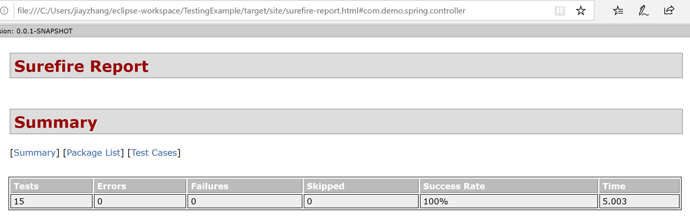

# Spring4JUnitTesting
A Spring 4 MVC application for task management | Unit testing with JUnit and Mockito

Table of Contents
=================
1. [ Preview of the Full Source Code ](#preview) 
2. [ Automated Unit Testing ](#testing)
3. [ Test Reports and Code Coverage ](#report)
4. [ Sources ](#source)

## Preview of the Full Source Code 
### Initialize Object Task

### Example of the Web Layer

### Example of the Service Implementation

### Example of the Repository Implementation

## Automated Unit Testing
* Frameworks used
  * Spring MVC Test Framework
    - Spring MVC test framework contains MockMvc and other test classes that can be used to perform and validate requests on a specific endpoint.
  * JUnit 5
    - JUnit Platform
    - JUnit Jupiter 
  * Mockito
    - Mockito is a JAVA-based library that is used to facilitate creating mock objects.
  
### The Benefits of Automated Unit Testing
* Studies have shown that unit testing can successfully reduce defects in the development stage by 20.9%.
* Fixing a defect after releasing the product may cost 100x more than fixing a bug at design and development stages.

### Why We Should Execute Unit Tests on Spring Applications?
* Unit testing allows developers to test the smallest unit of the source code. It isolates the individual testable piece of code from other parts of the code and determines if that unit is behaving as expected. 
* The three layers (web, service, and repository) of the Spring framework are closely connected. When changes are made to a small part of the code, the existing functionality should not break. Unit testing lets developers verify the behavior of a particular piece of code independently from other parts.

### The Benefits of Mocking with Mockito on Spring Applications
* It is common for a class or method under test to have dependencies on other complex units in Spring Framework. To simulate the behavior of the real unit and also isolate from its dependencies in unit testing, other unit can be replaced by mocked objects.
* Mocking verifies both the behavior of the unit under test and if the unit under test calls the mocked object as expected.

### The Advantages of Unit Testing with JUnit 5
* The assertions class from JUnit Jupiter API is used to test the mocked unit under test with some specific data.
* The *BeforeEach* and *AfterEach* annotations are used to set up and clean up the mocked object. 

### The Advantages of Unit Testing with Spring MVC Test Framework
* The goal of using Spring MVC Test is to create an effective way for testing the controllers by using *MockMvc*. 
* *MockMvc* container can tests the endpoints with mocked object.
* *Standalone* configures the controller component under test and execute it in isolation from other controllers. 
* The controller’s annotations are processed by *Standalone* configuration to carry out the behavior of that controller.

## Test Reports and Code Coverage
### Example of Maven Test Reports

### Example of Code Coverage

## Sources
1. “Why Unit Testing?” Why Unit Testing? | Agitar Technologies: Putting Java to the Test, www.agitar.com/solutions/why_unit_testing.html.
2. Williams, Laurie, et al. On the Effectiveness of Unit Test Automation at Microsoft - IEEE Conference Publication, IEEE, 28 Dec. 2009, ieeexplore.ieee.org/document/5362086.f
